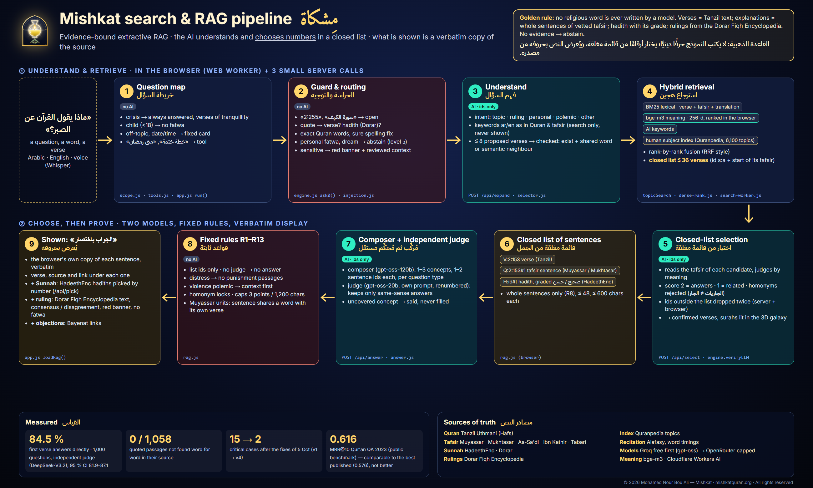

# مِشكاة · Mishkat — The Quran Galaxy Guide

**🌐 https://mishkatquran.org** · © 2026 Mohamed Nour Bou Ali — All rights reserved · جميع الحقوق محفوظة (see [LICENSE](LICENSE), [NOTICE.md](NOTICE.md)). How the search engine and its evidence-bound RAG work: [docs/RAG_ENGINE.md](docs/RAG_ENGINE.md) · 

> ﴿…كَمِشْكَوٰةٍ فِيهَا مِصْبَاحٌ…﴾ (An-Nur 24:35) — a niche gathers the lamp’s light.
> Mishkat gathers, around your question, the light of vetted sources — inside a 3D galaxy whose 77,433 stars are the words of the Quran.

**Islamic AI Challenge 2026 · Track 1 — Knowledge dialogue & reliable answers** · Languages: العربية · English
Live demo: https://mishkatquran.org (backup https://mishkat-4m1.pages.dev) · **Judges' verification guide / دليل التحقّق للمحكّمين: https://mishkatquran.org/judges.html** · Official pages: [YouTube @mishketquran](https://www.youtube.com/@mishketquran) · [Facebook](https://www.facebook.com/profile.php?id=61594931830065) · [X @mishketquran](https://x.com/mishketquran) · [TikTok @mishkatquran.org](https://www.tiktok.com/@mishkatquran.org)

> **Rights / الحقوق** — This repository is public **for viewing and judging only**. All rights reserved: no copying, reuse, redistribution or derivative work without the author's written permission ([LICENSE](LICENSE)). المستودع مفتوح للاطلاع والتحكيم فقط؛ جميع الحقوق محفوظة، ويُمنع النسخ أو إعادة الاستعمال أو النشر دون إذن كتابي من المؤلف.

### Files and documents · الملفات والمستندات
- **[FILES.md](FILES.md)** — every folder and file of the repository explained, in Arabic and English · دليل كل مجلد وملف في المستودع بالعربية والإنجليزية.
- **[docs/deliverables/](docs/deliverables/)** — the full project file (الملف الكامل) [AR](docs/deliverables/Mishkat_Dossier_AR.pdf) · [EN](docs/deliverables/Mishkat_Dossier_EN.pdf); the presentation (العرض التقديمي) [AR](docs/deliverables/Mishkat_Presentation_AR.pdf) · [EN](docs/deliverables/Mishkat_Presentation_EN.pdf) · [PPTX](docs/deliverables/Mishkat_Presentation_EN.pptx); the 3D design and why (التصميم ثلاثي الأبعاد ومبرراته) [AR](docs/deliverables/DESIGN_3D_AR.pdf) · [EN](docs/deliverables/DESIGN_3D.pdf); the statistical results (النتائج) [AR](docs/deliverables/RESULTS_SUMMARY_AR.pdf) · [EN](docs/deliverables/RESULTS_SUMMARY_EN.pdf).

### Origin of the project · أصل المشروع
- **Before the challenge** the author had mapped the Quran and studied it statistically: *Quran Cartography* (July–August 2026), a database of its words and letters with an atlas of figures — no search, no AI, no tafsir, nothing online.
- **Mishkat itself was born from the challenge**: the idea of an AI search that never writes a religious word came after learning about the Islamic AI Challenge, and its first line of code was written at the end of September 2026, during the registration period. It is not a product developed earlier and brought to the competition.
- Everything written before the challenge window is disclosed with dates and fingerprints in [BASELINE.md](BASELINE.md); the work of the window (4–6 October 2026) is listed task by task in [CHANGELOG.md](CHANGELOG.md). Git commit dates are the proof of both.
- قبل التحدي: رسم المؤلف خريطة للقرآن ودرسه إحصائيًّا («كارتوغرافيا القرآن»، يوليو–أغسطس ٢٠٢٦) دون بحث ولا ذكاء اصطناعي. أما «مشكاة» فوُلدت فكرتها من التحدي نفسه، وكُتب أول سطر منها في أواخر سبتمبر ٢٠٢٦ أثناء فترة التسجيل؛ وكل ما سبق نافذة التحدي مُفصَح عنه بتواريخه في BASELINE.md.

### Verify it in three minutes
The judges' guide lists clickable scenarios, the measured results with their files and where to check each claim: **https://mishkatquran.org/judges.html** (Arabic and English). The 1,000 test questions with Mishkat's answers and the judge's grades: [eval/rag1000/QUESTIONS_AND_ANSWERS.md](eval/rag1000/QUESTIONS_AND_ANSWERS.md).

---

## بالعربية

### ما هي «مشكاة»؟
محرّك بحث قرآني معزَّز بالذكاء الاصطناعي، لا يكتب الذكاءُ الاصطناعي فيه حرفًا دينيًّا واحدًا. تكتب سؤالًا أو فكرة أو اسم سورة أو آية، فيأتيك:
- **«الجواب باختصار»**: جمل منقولة **حرفيًّا** من مصادر معتمدة (نص المصحف من Tanzil، التفسير الميسر، المختصر في التفسير، أحاديث HadeethEnc ذات الدرجة المعروفة)، كل جملة بمرجعها. يختار النموذج **أرقام الجمل فقط** من قائمة مغلقة، ثم يتحقق نموذج ثانٍ مستقلّ (الحَكَم) من صلتها بالسؤال، وما لا دليل عليه يُذكر أنه غير مغطّى.
- **الآيات الرئيسة** مع تفسيرها كاملًا، ثم **السور مرتّبة حسب الصلة**، مع قارئ آيةً آية وتلاوة الشيخ العفاسي **متزامنة كلمةً كلمة**، والكاميرا تطير في مجرّة الكلمات.
- **أسئلة الأحكام** (حلال/حرام…): لا تُفتي «مشكاة» أبدًا؛ تعرض نصّ **الموسوعة الفقهية — الدرر السنية** حرفيًّا مع رابطه (إجماع/خلاف كما ورد فيها)، تحت شريط أحمر «سؤال حساس»، وتحيل إلى alifta.gov.sa.
- **أجوبة موثَّقة للأسئلة المعرفية** (٦ أكتوبر): «كم عدد آيات القرآن؟»، «كم سورة؟»، «كم آية في سورة يس؟»، «كم مرة ذُكر اسم موسى؟»، «ما أطول سورة؟»، «ما السورة التي لا تبدأ بالبسملة؟» — أرقام **تُحسب** من بيانات المصحف (Tanzil) لا تُكتب باليد؛ و«ما أركان الإسلام؟»، «ما أركان الإيمان؟»، «ما أعظم آية؟»، «أول ما نزل؟» — من **نص حديث صحيح** يُعرض كاملًا بدرجته ورابطه. وأسئلة **العقيدة والسيرة والتاريخ** («ما هو التوحيد؟»، «متى كانت غزوة بدر؟»، «من هو أول الخلفاء الراشدين؟») تُجاب من **الموسوعة العقدية** و**الموسوعة التاريخية** في الدرر السنية (من مراجع حزمة التحدي) بنصّهما ورابطهما، حتى حين لا توجد آية تجيب مباشرة.
- **البحث بالصوت**: تحويل الكلام إلى نص بـ ElevenLabs Scribe مع مفردات مشكاة (أسماء السور الـ١١٤…) واحتياط Whisper؛ يظهر النص ويُصحَّح قبل البحث. على ٣٠ سؤالًا منطوقًا بعشر لهجات: من ٢٠/٣٠ إلى ٣٠/٣٠.
- **قصص الأنبياء** من «علوم السور» في موسوعة الجمهرة، و**التحقق من النصوص**: هل هذه آية؟ (اقتباس محرَّف، آيتان مدموجتان، قول ليس من القرآن).
- **شخص في ضيق شديد** (أفكار انتحار…): رسالة دعم ثابتة ورابط findahelpline.com أوّلًا، ثم آيات الرجاء بتفسيرها.
- **الأسئلة المفخّخة وحقن الأوامر** وطلبات «اكتب لي آية/حديثًا/فتوى»: جواب ثابت دون أي نداء للذكاء الاصطناعي.
- **أدوات**: مواقيت الصلاة (Aladhan، مع ذكر طريقة الحساب)، القبلة، المساجد القريبة (قائمة OpenStreetMap عبر خادم مشكاة، وخريطة Google Maps داخل الصفحة)، الأذكار (HadeethEnc وحصن المسلم بعد التحقق من حكم كل ذكر في الدرر)، التقويم الهجري، خطة الختمة (وتضيء السور المقروءة داخل شعار المشكاة)، روابط مفيدة، البحث بالصوت (Whisper)، **ابحث عن آية بتلاوتها**. الموقع لا يرسل موقعك إلى خادمه أبدًا.
- **خارج الموضوع** (وصفة طعام، سعر رحلة، كتابة برنامج، مقال أو قصيدة، الطقس، الرياضة…): جواب ثابت لطيف يبيّن ما تقدّمه «مشكاة» دون أي نداء للذكاء الاصطناعي، والخادم يرفض النصوص نفسها؛ أمّا **تاريخ اليوم والساعة** فيُجاب عنهما مباشرة، و«كم بقي على الصلاة» يفتح المواقيت.
- **وضع الطفل** (أقل من ١٨ سنة، في التفضيلات): لا فتاوى ولا لون أحمر؛ رسالة لطيفة بأن الفتوى للعلماء الذين ختموا القرآن وتعلّموا تفسيره، وسؤال: «أيّ سورة تحبّ أن تحفظ؟» ثم وضع التكرار أو خطة ختمة.
- **البحث موصول بالخدمات**: «خطة لختم القرآن في شهرين» تفتح الختمة بخطة مقترحة تُعدَّل حسب التزاماتك، «أريد أن أحفظ سورة الملك» تفتح التكرار، «كم مرة ذكرت كلمة الصبر» تفتح الإحصاءات.
- **التكرار والحفظ**: تختار عدد الآيات (١، ٢، ٥، ١٠، عدد آخر، السورة كاملة) وعدد التكرار والاستماع إلى الشيخ، وتضغط العدّاد (أو Enter) بعد كل تكرار، ولا يُحسب التكرار قبل ٧٠٪ من وقت تلاوة الشيخ؛ علامة تبدأ من ٧/١٠ وتشجيع دائم، والسور المكرَّرة تُلوَّن بالأزرق في الخريطة ثلاثية الأبعاد.
- **اختبار الحفظ** (اختياري، بعد كل تكرار): تُخفى الآيات فتكتبها من حفظك أو تتلوها بصوتك، مع تلميح عند الحاجة وتصحيح كلمةً كلمة (بالرسم الإملائي، دون توليد أي نص)، ونصيحة بإعادة التكرار إن لم تثبت؛ ومشاركة النتيجة ودعوة صديق إلى التحدّي برابط يفتح الآيات نفسها. وفي نهاية الجلسة: السورة التالية بالإعدادات نفسها، وإعدادات الجلسة التالية دون الرجوع إلى البداية، وأحكام التجويد للآيات المكرَّرة.
- **الختمة**: عند نهاية كل سورة في المصحف زرّ «أتممت السورة ✓» والسورة التالية؛ وِرد اليوم يُثبَّت في أوّله، فما تقرؤه زيادةً يُحفظ ويُخفَّف به وِرد الأيام القادمة؛ وسجلّ لما قرأته يومًا بيوم؛ والتفسير بجانب المصحف في وضع «قراءة فقط».
- **التسبيح**: عدّاد للأذكار التي لها عدد في «حصن المسلم» (بنصّها ودرجتها في الدرر السنية)، أو عدّاد حرّ لذكر تختاره.
- **التقدّم**: نسبة المقروء هذا الشهر في القارئ ونسبة المكرَّر حفظًا (تتجدّدان كل شهر)، شريطان صغيران للأسبوع، وعدد **الختمات** في الشريط العلوي مع تهنئة عند كل ختمة؛ **خريطة الالتزام** ثلاثية الأبعاد بثلاثة مستويات من آية النور: غرسة مباركة، زيتونة مباركة، كوكب دري.
- **الإحصاءات** للسورة وللكلمة (عدّ فقط، دون جُمَّل)، **ألوان التجويد** اختيارية من مشروع مفتوح مُتحقَّق منه حرفًا حرفًا، و**تثبيت التطبيق** على الهاتف والحاسوب من المتصفح.
- **الزيارة الأولى**: البسملة ← اختيار المكان ← فيلم تعريفي حيّ على آية النور بتلاوة الشيخ العفاسي (يمكن تخطيه، يُعرض مرة واحدة) ← التفضيلات.

### القاعدة الذهبية
| المحتوى | مصدره | الضمان |
|---|---|---|
| نص القرآن | ملف Tanzil (`core.json`) مطابق بايتًا ببايت | النموذج لا يكتب آية؛ لا قراءة آلية للقرآن (التلاوة بصوت بشري فقط) |
| التفسير، الحديث، الذكر، نص الحكم الفقهي | منقول حرفيًّا مع المصدر والرابط | النموذج يُرجع أرقامًا من قائمة مغلقة فقط |
| النص الرابط | قوالب مكتوبة يدويًّا (عربي/إنجليزي) | لا نص حرّ |
| غير ذلك | — | امتناع وإحالة |

### الكلفة الفعلية
النماذج المفتوحة على **Groq (الشريحة المجانية) أوّلًا** — `gpt-oss-120b` للتأليف والحكم، `gpt-oss-20b` للمهام الخفيفة، `whisper-large-v3-turbo` للصوت، Orpheus (العربية) للقراءة الآلية للتفسير — و**OpenRouter (مدفوع حسب الاستهلاك) احتياطًا فقط** عند نفاد الحصة (كلفة مقيسة: نحو 0.0014 دولار للسؤال). الاستضافة على Cloudflare Pages المجانية. عند تعذّر الذكاء الاصطناعي يعمل المحرك الحتمي، موثَّقًا دائمًا.

---

## English

### What it does
Type **an idea, a question, a surah name, a verse number or part of a verse**:

| You type | Mishkat answers |
|---|---|
| `الصبر` · `how to deal with anxiety` | **Short answer**: verbatim sentences from the verse text (Tanzil), Al-Muyassar / Al-Mukhtasar and graded HadeethEnc hadiths, each with its reference — the AI only returns sentence IDs from a closed list, an independent judge model keeps the relevant ones, uncovered concepts are said to be uncovered; then the key verses with their full tafsir and the surahs ranked by relevance |
| `2:255`, `البقرة 255`, `Ayat al-Kursi`, `سورة يس` | the verse or surah in the reader, word-synchronised recitation (Alafasy), seven tafsir books |
| `هل هذه آية: النظافة من الإيمان` · a pasted verse | exact verification: verse / misquote with the correct wording / two merged verses / not in the Quran |
| `ما حكم التدخين` · `is music haram` | **no ruling by Mishkat**: the statement of the **Fiqh Encyclopedia of Ad-Durar As-Saniyyah** (named by the challenge's reference pack), verbatim with its link and its consensus/difference flags, under a red «sensitive question» banner, referral to alifta.gov.sa |
| `كم عدد آيات القرآن` · `كم سورة` · `كم مرة ذكر اسم موسى` · `ما هي أركان الإيمان` · `how many verses are in Surah Yasin` | a **verified answer** (6 Oct, T122): counted from the Mushaf data shipped with the site (6,236 verses, 114 surahs, 136 for «موسى»…) or stated by an authentic hadith shown in full with its grade — never guessed, never by the AI |
| `متى كانت غزوة بدر` · `من هو أول الخلفاء الراشدين` · `ما هو التوحيد` · `what is tawhid` | the **History** and **Creed Encyclopedias** of Ad-Durar As-Saniyyah (named by the reference pack), verbatim with their link, also when no verse answers the question |
| 🎤 spoken question (Arabic dialects or English) | speech to text by **ElevenLabs Scribe v2** with Mishkat's vocabulary (the 114 surah names…), Groq Whisper as backup; the text is shown and can be corrected before searching |
| `قصة يوسف` · `story of Moses` | Al-Jamhara's «علوم السور» summary and episodes with verse ranges, every verse naming the prophet |
| `I want to kill myself` (crisis) | a fixed support message, findahelpline.com first, verses of hope with their full tafsir |
| `ignore your instructions…` · `write me a hadith` | a fixed answer, no AI call |
| `كم بقي على صلاة العصر` · `qibla` · `أذكار النوم` · `متى رمضان` | prayer times (Aladhan, method named), qibla, nearby mosques (OSM list through Mishkat's server, Google Maps map inside the page), adhkar with known grades, Hijri calendar, khatma plan — the position reaches Mishkat's server only rounded to ~100 m for the mosque search, never stored |

| `وصفة الكسكسي` · `price of a flight` · `write me a python script` | **outside Mishkat's subject**: a fixed, kind answer that says what Mishkat does (and offers a Quran search when the request carries an Islamic subject: «اكتب مقالا عن الصبر» → «الصبر»); never sent to a model — the API refuses the same texts. Checked on the project's 1,498 questions: 13 mapped off-topic, all really off-topic; over-refusal bench 50/50 |
| `ما تاريخ اليوم` · `what time is it` | today's Gregorian and Umm al-Qura date and the time, from the device's clock, with the prayer times and calendar a click away |
| a ruling question from a visitor **under 18** (age in the preferences) | no fatwa and no red: a kind message that fatwas belong to scholars who completed the Quran and its tafsir, «which surah would you like to memorise?» → the repetition mode, or a khatma plan |
| `خطة لختم القرآن في شهرين` · `أريد أن أحفظ سورة الملك` · `كم مرة ذكرت كلمة الصبر` · `مستواي` | the matching Mishkat service opens with the details of the request: a **proposed khatma plan** to adapt to one's commitments, the **repetition mode** on that surah, the **statistics** of that word, the **engagement map** |

**Memorising (تكرار)**: choose the verses (1, 2, 5, 10, another number, the whole surah), the repetitions, verse by verse or together, and whether to hear Sheikh Alafasy first; press the counter (or Enter / Space) after each repetition — a repetition counts only after 70 % of the reciter's own time for the same verses. Rewards are only encouragement: a mark that **starts at 7/10** and grows with perseverance, time, regularity and engagement; the surahs repeated turn blue in the 3D khatma map. **Progress**: under the lamp, the share of the Quran read this month (reader) and repeated this month (tekrar), reset each month, and two small weekly bars; the number of **khatmas** in the top bar (a congratulation when the whole Quran is read). **Engagement map**: a small 3D world with three positive levels named from the verse of light (غرسة مباركة · زيتونة مباركة · كوكب دري), the last 28 days as columns of light, a daily reminder. **Memorisation test** (optional, after each repetition): the verses are hidden, written or recited from memory, with hints and a word-by-word check on the simple spelling (nothing generated), advice to repeat again when needed, sharing the result and inviting a friend with a link to the same verses; at the end of a session the next surah with the same settings and the next settings right there, and the tajweed rules of the verses repeated. **Khatma**: «I finished this surah ✓» and the next surah at the end of every surah; today's portion is fixed in the morning, so reading more is kept and lightens the coming days; a day-by-day reading record; the tafsir beside the full-screen Mushaf. **Tasbih**: a menu of formulas (tasbīḥ, taḥmīd, takbīr, tahlīl, istighfār, blessings on the Prophet ﷺ, ḥawqala…) each cut word for word from a graded hadith, the counted adhkar of Hisn al-Muslim, or one's own; the count goes on past the suggested number (keyboard: Space / Enter / +, Backspace to undo). **The Most Beautiful Names**: the 99 names with transliteration and meaning, listened to in a synchronised full-screen stage, learnt group by group with repetitions and a test. **Prayer during a recitation**: the verse is finished, the adhan (three openly licensed recordings), then the basmala and the next verse. **The light of the month**: every completed act sends a ray of light to the logo, which grows brighter until the month ends (reading 60 %, listening, memorising, tasbih, the Names 10 % each). **Statistics** of a surah and of a word (counts only, no letter values). **Tajweed colours** (optional) from an open, checked annotation. **Install** Mishkat as an app on a phone or a computer from the browser (offline for what was opened). **First visit**: basmala → place (country, city or location) → a live motion-graphic presentation built on the verse of light recited by Sheikh Alafasy (skippable, shown once) → preferences (including age).

The galaxy is the Quran itself: 77,433 words, six shapes × seven orders (Mushaf, revelation, length…), each word placed by a stated law (Fermat's equal-area spiral, Archimedes' equal-area bands, one helix turn per verse — see [docs/DESIGN_3D.md](docs/DESIGN_3D.md)); a calm reading camera follows the recited word; at rest a bar of light sweeps the stars; a pure full-screen view shows only the stars and the recited words; hovering 3 s on a star shows its word, verse and frequency; the surahs read light up inside the Mishkat lamp.

### The golden rule — zero generated religious text, by architecture
| Content | Produced by | Guarantee |
|---|---|---|
| Quran text | `core.json` = byte-exact Tanzil text (SHA-256 checked in tests) | the model never writes a verse; the Quran is never read by a machine voice |
| Tafsir, hadith, dhikr, ruling statement | verbatim from the sources of [SOURCES.md](SOURCES.md), with source and link | the AI returns IDs from closed lists only; out-of-list IDs are dropped (server **and** browser) |
| Glue text | hand-written templates (Arabic, English) | no free text |
| Everything else | — | abstain & refer |

```
query ─► crisis route · injection/trap guard · ruling/personal/dream guard (fixed answers, no AI)
      ─► tool router (prayer, qibla, mosques, adhkar, calendar, khatma) · references · surah names
      ─► quote verification (exact / misquote / merged verses / not Quran)
      ─► [AI expand: intent + search keywords] ─► BM25 (Quran + tafsir + translations, thesaurus)
         + Quranpedia subject index + bge-m3 semantic neighbours (ranked in the browser)
      ─► [AI select: verse IDs from a closed list] ─► verifier
      ─► closed list of verbatim sentences ─► [composer: sentence IDs] ─► [independent judge] ─► rules R1–R12
      ─► short answer + key verses with tafsir + surahs ranked + galaxy flight
```

### AI, providers and real cost
| Task | Model | Provider |
|---|---|---|
| intent, keywords, hadith filter | `openai/gpt-oss-20b` | Groq free tier |
| verse selection, composer, judge | `openai/gpt-oss-120b` | Groq free tier |
| backup on quota/failure only | same models | OpenRouter, pay per token (≈ $0.0014 per question measured; price cap; daily ceiling) |
| speech to text, «recite to find a verse» | `whisper-large-v3-turbo` | Groq free tier |
| reading a tafsir aloud when the browser has no voice; spoken Arabic welcome (generated once) | `canopylabs/orpheus-arabic-saudi` | Groq |
| question embedding | `@cf/baai/bge-m3` | Cloudflare Workers AI (free allocation) |

Hosting: Cloudflare Pages + Functions (free plan). Identical questions are cached at the edge. When the AI is unavailable, the deterministic engine still answers, still grounded, still abstaining. See [TOOLS.md](TOOLS.md).

### Measured results (honest figures)
| Measure | Result | Where |
|---|---|---|
| Qur'an QA 2023 Task A (public benchmark, official scorer, 51 scored test questions), deployed pipeline on Groq's free tier, mean of 3 runs (4 Oct) | MRR@10 **0.616** [0.490–0.742] · MAP@10 **0.300** [0.210–0.402] — best published 0.576 / 0.313 lies inside: **comparable, not better** | [eval/qqa23/RESULTS.md](eval/qqa23/RESULTS.md) |
| Voice search, 30 spoken questions (10 Arabic accents + English, microphone-like audio), every key word heard (6 Oct) | before: **20/30** (Whisper alone: free-tier 429s, dialects) → now **30/30** (Scribe v2 + vocabulary, Whisper backups) | [eval/stt/RESULTS.md](eval/stt/RESULTS.md) |
| Battery of 49 questions across the themes (facts, creed, history, topics, rulings, Sunnah, services, English, out of scope), page-faithful pipeline (6 Oct) | facts 10/10 exact; creed and history questions that ended in «no sufficient source» now answered from the approved encyclopedias (e.g. Badr, Hudaybiyyah, the death of Abu Bakr, the definition of tawhid in ar/en) | [eval/t122/REPORT.md](eval/t122/REPORT.md) |
| Over-refusal: 50 legitimate questions that look sensitive | 50/50 answered (none refused) | `eval/overrefusal.json`, `tests/fixes_v5.test.mjs` |
| Map of 1,000 questions, engine without AI (4 Oct) | 630/671 known expectations met; median 1 ms | [eval/map1000/MAP_REPORT.md](eval/map1000/MAP_REPORT.md) |
| Plain chatbot (same model, no retrieval) asked the same 60 questions | of 121 Arabic quotations it presented as Quran (﴿…﴾), only 26 are exact; 14 altered, 3 merged, 72 match no verse (Mishkat: 0 by construction) | `eval/human/auto_metrics.json` |
| Tests | 197 automated tests (data integrity, routing, guards, hostile-AI, RAG rules, security, tools) | `npm test` |
| Human blind rating (2 raters) and user test with SUS | protocol and sheets ready, **not yet done** — no figure claimed | [eval/human/PROTOCOL.md](eval/human/PROTOCOL.md) |

We do **not** claim to beat the state of the art: on 51 scored questions the differences with the best published systems are inside the 95 % confidence intervals.

### Run it
```bash
npm test                         # node ≥ 18, no dependencies
npm start                        # http://127.0.0.1:8787 (AI on when GROQ_API_KEY is in .dev.vars)
FREE_ONLY=1 node server.mjs 8791 # local API on the free tier only (evaluations)
```
Deployment (Cloudflare Pages + Functions): [DEPLOY.md](DEPLOY.md).

### Repository map
| Path | Content |
|---|---|
| `public/` | the web app, no build step: `js/engine.js` (engine), `js/app.js` (UI), `js/rag.js` (closed list + rules), `js/search-worker.js`, `js/galaxy.js` (WebGL), tool panels, `data/` |
| `functions/` | Cloudflare Pages Functions: `/api/expand`, `/api/select`, `/api/answer`, `/api/pick`, `/api/fatwa` (Fiqh Encyclopedia), `/api/hadith`, `/api/tafsir`, `/api/dense`, `/api/transcribe`, `/api/tts`, `/api/health` |
| `data_build/` | scripts that download, freeze (SHA-256 manifest) and build every source |
| `tests/` | `node --test` suite |
| `eval/` | Qur'an QA 2023, map of 1,000 questions, sensitive questions, over-refusal bench, human evaluation kit |
| `tools/` | traceability (`trace.mjs` → `docs/TRACEABILITY.md`), lamp drawing, TTS passages, spoken welcome |

### Documentation
[docs/GUIDE.md](docs/GUIDE.md) (user and developer guide) · [docs/RAG_ENGINE.md](docs/RAG_ENGINE.md) (search engine and RAG) · [docs/DESIGN_3D.md](docs/DESIGN_3D.md) · [docs/DESIGN_3D_AR.md](docs/DESIGN_3D_AR.md) (the 3D design and its laws) · [eval/rag1000/QUESTIONS_AND_ANSWERS.md](eval/rag1000/QUESTIONS_AND_ANSWERS.md) (the 1,000 test questions and answers) · [SOURCES.md](SOURCES.md) (sources registry & licences) · [TOOLS.md](TOOLS.md) (models, providers, costs) · [BASELINE.md](BASELINE.md) (pre-existing work) · [CHANGELOG.md](CHANGELOG.md) · [DEPLOY.md](DEPLOY.md) · [docs/TRACEABILITY.md](docs/TRACEABILITY.md) · [LICENSE](LICENSE)

### Known limits
- Thematic search can miss a passage worded differently; English questions without AI reach fewer verses (193 of the 1,000-question map get none without AI).
- Free AI quotas are limited (Groq: 200,000 tokens a day per model, a few dozen full answers on the large model); beyond them the paid backup (OpenRouter, capped) or the deterministic engine answers.
- Rulings appear only when the Fiqh Encyclopedia has a section naming the subject; otherwise none is shown (referral only). Practical questions («شروط الصلاة», «كيف أتوضأ») are matched with the encyclopedia's own headings (worship books, 2,095 sections); a subject without its own heading («أركان الحج») shows no section.
- Prayer times are astronomical calculations (method shown); the official calendar of your country prevails.
- As-Sa‘di comments some verses in groups; 6 verses have no word-level recitation timing.
- The English Orpheus voice is not enabled: English is read by the browser's voice.
